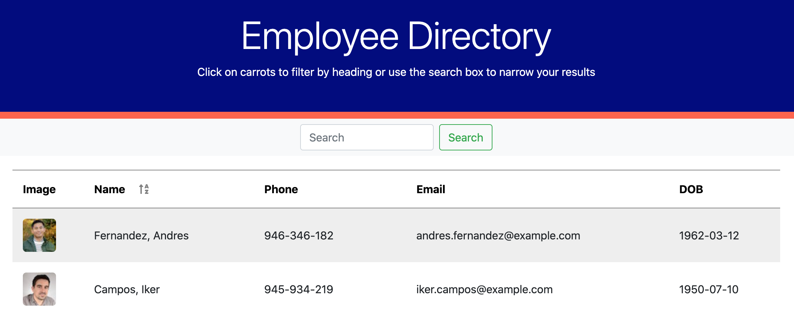

[](https://www.gnu.org/licenses/gpl-3.0)
  # Employee Directory

  

  ## Table of Contents
  * [Description](#description)
  * [Installation](#installation)
  * [Usage](#usage)
  * [Contributing](#contributing)
  * [Tests](#tests)
  * [Questions](#questions)
  * [License](#license)

  ## Description
  I was tasked with building out an employee directory using React. A table is used to display employees that can be filtered and sorted. The sorting/filtering was achieved using stateful components that filtered from a list of seed data. An axios api call retrieved random user data from [randomuser.me](https://randomuser.me/) and wrote to a json file. The employee information is displayed on the table via a map function. The first class method sorts employees by last name from A->Z when the 'name' header is clicked and the reverse (Z->A) when it is clicked again. The second method employs a search bar that can filter the found results by any category. 
  ## Installation
  A package json is included with all the necessary dependencies. The command ```npm i``` will install all necessary dependencies.
  ## Usage
  The following is a link to the deployed site:
  
  [Employee Directory](https://dgtlctzn.github.io/employee-directory/)
  ## Contributing
  The following is a list of technologies used in this application: 
  * React 
  * Axios 
  * randomuser.me
  ## Tests
  N/A
  ## Questions
  Github profile: [dgtlctzn](https://github.com/dgtlctzn)
  
  If you have any questions about the project please contact josephperry720@gmail.com
  ## License
  This project is covered under the GNU license
